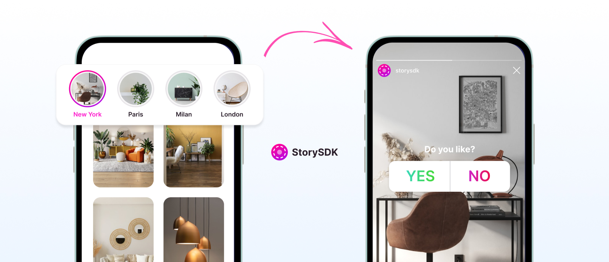
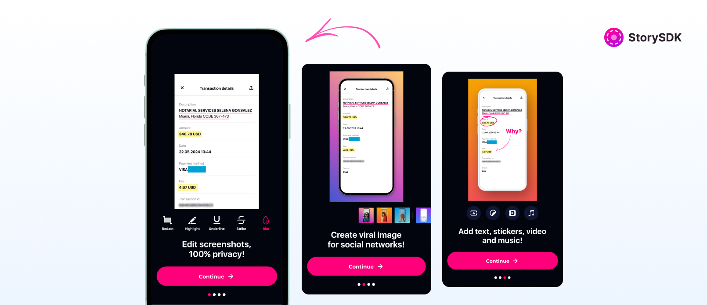

# StorySDK

[](https://github.com/StorySDK/ios-sdk/releases)
[](https://github.com/StorySDK/ios-sdk/blob/master/LICENSE)
[](https://github.com/StorySDK/ios-sdk)

### iOS Framework for the StorySDK Service

The StorySDK iOS Framework is a software development kit (SDK) for iOS app developers to integrate the StorySDK service into their mobile applications. The StorySDK service provides a platform for creating and adding stories to mobile apps.

By integrating the StorySDK iOS Framework into an iOS app, developers can add the following features:

- Embed onboardings
- Display groups of stories using the Groups Widget
- Access the direct API to retrieve application information, groups, and stories
- Customize the configuration of the SDK, such as enabling full screen mode, showing/hiding the title, setting the duration for each story, and setting the progress color.

The StorySDK iOS Framework is available for installation via CocoaPods, Carthage, and Swift Package Manager. The framework is open source and available on GitHub, where developers can contribute to the development of the framework, report issues, and request new features.

<picture>
    <source srcset="./media/storysdk-widget.jpg" media="(prefers-color-scheme: dark)" alt="Group of stories">
    
</picture>

### Why Use StorySDK?

The StorySDK service provides a platform for mobile app developers to create and add stories to their apps, which can increase user engagement and provide a more dynamic user experience. By integrating the StorySDK iOS Framework into an iOS app, developers can access the features of the StorySDK service without having to build the functionality from scratch, saving development time and effort.

The StorySDK service also provides a web-based dashboard for managing stories, which makes it easy for app developers to add and manage their app's stories. Additionally, the StorySDK service provides analytics on the usage of the stories, which can help app developers to measure the impact of their stories on user engagement.

## Installation

### Swift Package Manager

To install StorySDK using Swift Package Manager, follow these steps:

1. Open your project in Xcode and go to `File > Swift Packages > Add Package Dependency`.
2. In the search field, enter `https://github.com/StorySDK/ios-sdk.git` and click Next.
3. Select the version rule "Up to Next Major" and enter "1.0.0" in the text field.
4. Click Next and then Finish.

### CocoaPods

To install StorySDK using CocoaPods, add the following to your Podfile:

```ruby
source 'https://github.com/CocoaPods/Specs.git'
platform :ios, '13.0'
use_frameworks!

target 'MyApp' do
  pod 'StorySDK', '~> 1.0'
end
```

Then, run the following command:

```bash
$ pod install
```

#### Carthage

To install StorySDK using Carthage, add the following to your Cartfile:

```
github "StorySDK/ios-sdk" ~> 1.0
```

Then, run the following command:

```bash
$ carthage update
```

## Usage

Make sure to import the project wherever you may use it:

```swift
import StorySDK
```

### Setup

To use the SDK, you need to obtain a token from the StorySDK dashboard. You can find your token in the Settings section of the dashboard at [https://app.storysdk.com/dashboard/](https://app.storysdk.com/dashboard/).

```swift
var config = SRConfiguration(sdkId: "[YOUR_SDK_ID]")
StorySDK.shared.configuration = config
```

Further we consider that

```swift
storySdk = StorySDK.shared
```

### Integration

Define Groups Widget in your UIViewController

```swift
private var widget: SRStoryWidget!
```

Get information about the SDK application:

```swift
storySdk.getApps { result in
    switch result {
    case .success(let app):
        print(app)
    case .failure(let error):
        print("Error:", error.localizedDescription)
    }
}
```

Get the groups of the app and then call `widget.load()`:

```swift
storySdk.getGroups { result in
    switch result {
    case .success(let groups):
        print(groups)
        // Convenient place to call widget loading
        widget.load()
    case .failure(let error):
        print("Error:", error.localizedDescription)
    }
}
```

You can use the Groups Widget to display groups of stories in your app. Create and add the widget to your view hierarchy:

```swift
widget = SRStoryWidget()
widget.delegate = self
widget.translatesAutoresizingMaskIntoConstraints = false
view.addSubview(widget)
```

Layout widget:
```swift
NSLayoutConstraint.activate([
    widget.topAnchor.constraint(equalTo: view.safeAreaLayoutGuide.topAnchor),
    widget.widthAnchor.constraint(equalTo: view.widthAnchor),
    widget.heightAnchor.constraint(equalToConstant: 120.0),
])
```

Conform `SRStoryWidgetDelegate` protocol and implement openStories action:

```swift
func openStories(index: Int, groups: [SRStoryGroup], in vc: UIViewController,
                 delegate: SRStoryWidgetDelegate?, animated: Bool) {
    // SRNavigationController allows you to open specific group of stories
    let controller = SRNavigationController(index: index, groups: groups,
                                            backgroundColor: UIColor.gray)
    vc.present(controller, animated: animated)
}

// You can handle errors and taps on a group by conforming the `SRStoryWidgetDelegate` protocol
extension YourViewController: SRStoryWidgetDelegate {
    func onWidgetErrorReceived(_ error: Error, widget: SRStoryWidget) {}
    func onWidgetGroupPresent(index: Int, groups: [SRStoryGroup], widget: SRStoryWidget) {
        guard groups.count > index else { return }
        
        openStories(index: index, groups: groups, in: self, delegate: self, animated: true)
    }
    
    func onWidgetGroupsLoaded(groups: [SRStoryGroup]) {}
    func onWidgetGroupClose() {}
    func onWidgetMethodCall(_ selectorName: String?) {}
    func onWidgetLoading() {}
    func onWidgetLoaded() {}
}
```

When your app is ready to load groups, call `widget.load()`.

### Onboarding

<picture>
    <source srcset="./media/storysdk-onboarding.jpg" media="(prefers-color-scheme: dark)" alt="Onboarding">
    
</picture>

To add onboarding to your app, follow these steps:

1. First, create an onboarding in the Onboarding section of the dashboard at https://app.storysdk.com/dashboard/ and copy your Onboarding ID from Onboarding Settings

2. Then conform `SRStoryWidgetDelegate` protocol and fill some methods such implementation
(here we've added `dismiss` func that call paywall screen and `rate` func that request rate the app on second onboarding screen, this is a standard approach, you can implement similar or completely different behavior as you wish)

```swift
import StorySDK
import StoreKit

extension YourViewController: SRStoryWidgetDelegate {
    func onWidgetErrorReceived(_ error: Error, widget: SRStoryWidget) {}
    func onWidgetGroupPresent(index: Int, groups: [SRStoryGroup], widget: SRStoryWidget) {
        guard groups.count > index else { return }
        let group = groups[index]
        
        let controller = SRStoriesViewController(group, asOnboarding: true)
        controller.view.backgroundColor = UIColor.gray
        controller.delegate = self
        
        present(controller, animated: false)
    }
    
    func onWidgetGroupsLoaded(groups: [SRStoryGroup]) {
        widget?.openAsOnboarding(groupId: Constants.onboardingGroup)
    }

    func onWidgetGroupClose() {
        dismiss()
    }

    func onWidgetMethodCall(_ selectorName: String?) {
        guard let selectorName = selectorName else { return }
        
        let sel = NSSelectorFromString(selectorName)
        if canPerformAction(sel, withSender: self) {
            performSelector(onMainThread: sel, with: nil, waitUntilDone: true)
        }
    }

    func onWidgetLoading() {}
    func onWidgetLoaded() {}

    @objc func dismiss() {
        let vc = YourPaywallViewController(paywallID: "YOUR_PAYWALL_ID")
        let pvc = presentedViewController ?? self
        pvc.present(vc, animated: false)
    }
    
    @objc func scrollNext() {
        // NB: this method is called every time you move to the next story in onboarding
        // add a condition so that rate is called only once
        rate()
    }

    private func rate() {
        guard let scene = UIApplication.shared.connectedScenes
            .first(where: { $0.activationState == .foregroundActive }) as? UIWindowScene else {
            return
        }
        
        SKStoreReviewController.requestReview(in: scene)
    }
}
```

3. Caching (optional but useful step)

Often, to load stories faster, for example, to build onboarding in an app especially if you have video files in your stories, you may need to get them without waiting for loading from the server. In this case, caching will help you:

Caching is provided using a couple of lanes fastlane and consists of a few simple steps:

Install _fastlane_ first (by running the _fastlane_ 
command in the root of the project) and then follow the step above.

After run
   ```bash
   fastlane prepare_story_cache group:"groupId"
   ```
where groupId is the id of the group that contains the media files you want to cache.
If successful, you will see your media files in the "fastlane/cached" directory.

Now it’s enough to add these files to the Xcode project, like resources via _Add Files to..._ action so that they end up in the bundle of your app, that’s all - in this form `StorySDK` can already see them. Caching is now complete.

### Direct API

To show the stories of a selected group using the top view controller:

```swift
storySdk.getStories(group) { [weak self] result in
    switch result {
    case .success(let stories):
        guard !stories.isEmpty else { break } // No active stories
        // Present stories
    case .failure(let error):
         print("Error:", error.localizedDescription)
    }
}
```

#### Configuration
a) Set language

```swift
storySdk.configuration.language = "en"
```

b) Set full screen on / off

```swift
storySdk.configuration.needFullScreen = true / false
```

c) Show title on / off

```swift
storySdk.configuration.needShowTitle = true / false
```

d) Filter (hide) onboarding on / off

```swift
storySdk.configuration.onboardingFilter = true / false
```

e) Set show time duration for each story

```swift
storySdk.configuration.storyDuration = 10 // 10 seconds
```

f) Set progress color

```swift
storySdk.configuration.progressColor = .green
```

#### Advanced

StorySDK has a nice default loader. If you prefer to replace it with another one, that it also possible.
Ensure your custom loader confirms `SRLoader` protocol:

```swift
public protocol SRLoadingIndicator: AnyObject {
    func startAnimating()
    func stopAnimating()
}

public protocol SRLoader: SRLoadingIndicator where Self: UIView {}
```

You can just remove the loader if you don't need it:

```swift
storySdk.configuration.loader = nil
```

Or use the your own custom loaders, here are some examples:

<details>
  <summary>NVExtentedActivityIndicatorView</summary>

```swift
    import UIKit
    import StorySDK
    import NVActivityIndicatorView

    class NVExtentedActivityIndicatorView: UIView, SRLoader {
        var indicator: NVActivityIndicatorView = NVActivityIndicatorView.ballSpin()
        
        init() {
            super.init(frame: CGRect(x: 0, y: 0, width: 72, height: 72))
            addSubview(indicator)
        }
        
        required init?(coder: NSCoder) {
            fatalError("init(coder:) has not been implemented")
        }
        
        func startAnimating() {
            indicator.startAnimating()
        }
        func stopAnimating() {
            indicator.stopAnimating()
        }
    }
```
</details>


<details>
  <summary>Lottie</summary>

```swift
import UIKit
import StorySDK
import Lottie

class LottieLoadingIndicatorView: UIView, SRLoader {
    var indicator: LottieAnimationView!
    
    init() {
        super.init(frame: CGRect(x: 0, y: 0, width: 24, height: 24))
        
        indicator = LottieAnimationView(name: "equalizer-icon")
        addSubview(indicator)
    }
    
    required init?(coder: NSCoder) {
        fatalError("init(coder:) has not been implemented")
    }
    
    func startAnimating() {
        indicator.play()
    }
    
    func stopAnimating() {
        indicator.stop()
    }
}
```
</details>
or even
<details>
  <summary>Rive</summary>

```swift
import UIKit
import StorySDK
import RiveRuntime

class RiveLoadingIndicatorView: UIView, SRLoader {
    var model = RiveViewModel(fileName: "Screencut_Logo_Loader")
    var indicator: RiveView!
    
    init() {
        super.init(frame: CGRect(x: 0, y: 0, width: 80, height: 80))
        
        indicator = model.createRiveView()
        addSubview(indicator)
        indicator.frame = bounds
    }
    
    required init?(coder: NSCoder) {
        fatalError("init(coder:) has not been implemented")
    }
    
    func startAnimating() {
        model.play()
    }
    
    func stopAnimating() {
        model.stop()
    }
}
```
</details>

---
In additional you also can handle custom method defined in dashboard (using `onWidgetMethodCall` from `SRStoryWidgetDelegate` protocol) for instance define action on onboarding close event or request rate your during onboarding. Like this:

```swift
    func onWidgetMethodCall(_ selectorName: String?) {
        guard let selectorName else { return }
        
        switch selectorName {
        case "onboarding-finished":
            setupFinished()
        case "scrollNext":
            if !onRateDisplayed {
                onRateDisplayed = true
                rate()
            }
        default:
            break
        }
    }
```


## License

StorySDK is available under the MIT license. See the LICENSE file for more info.
